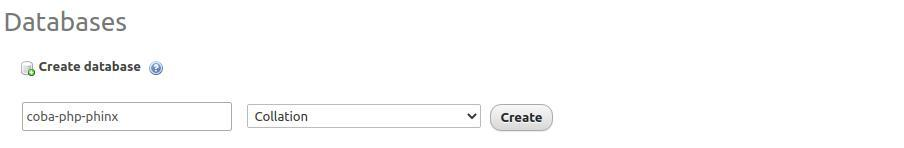
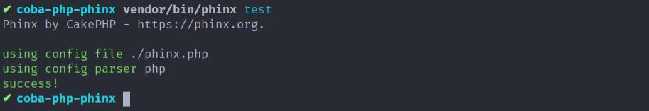
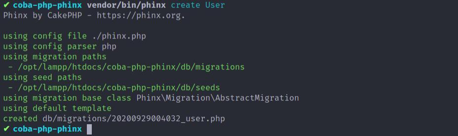
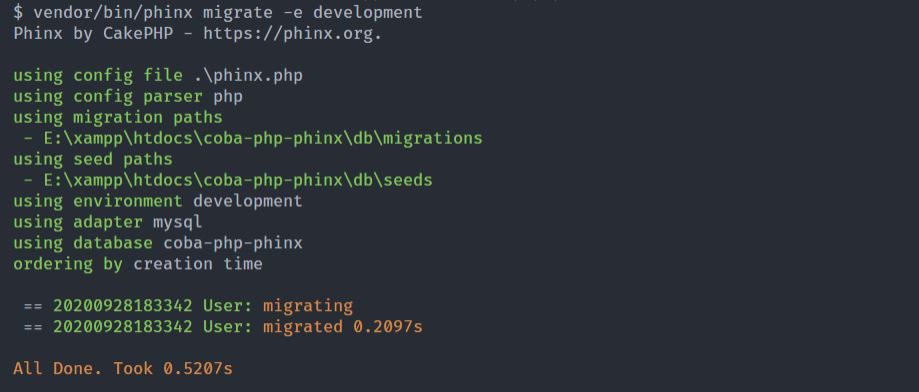
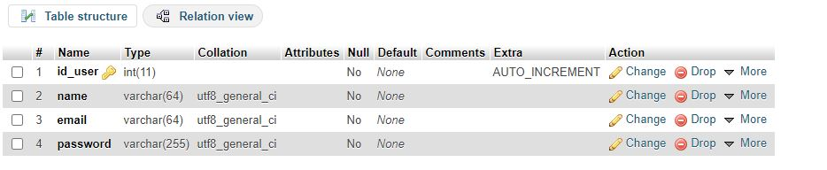
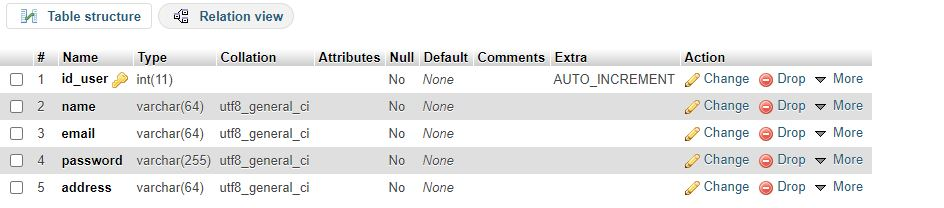
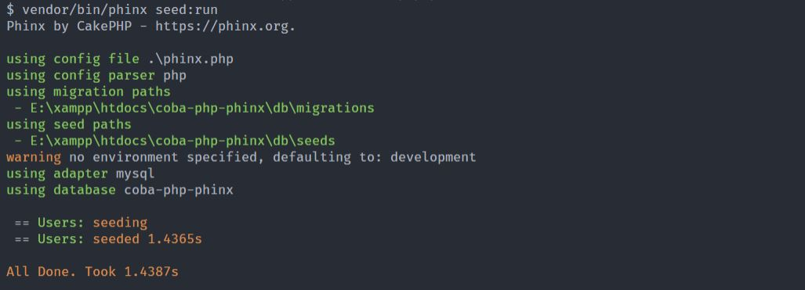
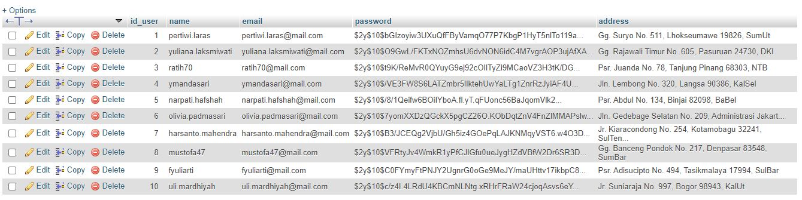

Source: [petanikode](https://www.petanikode.com/php-phinx/)

## Apa itu phinx?

Phinx adalah sebuah tools migrasi berbasis PHP yang dibuat oleh Rob Morgan.

Phinx akan membantu kita memanipulasi database dengan mudah, sehingga kita tidak lagi menulis skema SQL secara manual.

(itu sih penjelasan dari petanikode :smile:),

intinya penggunaan phinx
sendiri yaitu agar kita tidak export dan import database lagi secara
manual. Jadi langsung gass kita eksekusi....

## Install Phinx
sebelum menginstall phinx, pastikan temen temen sudah menginstall composer,
apa itu composer silahkan temen temen kepoin sendiri ya ;).

[Download Composer](https://getcomposer.org/)

Lanjuttt... kita buat folder(penamaan folder bebas yahh)
misal **coba-php-phix**.

```bash
mkdir coba-php-phix
cd coba-php-phix
```

Setelah itu install phinx menggunakan composer, bagi yang menggunakan windows silahkan
buka foldernya menggunakan cmd, atau yang memakai linux / mac bisa menggunakan terminalnya.

```bash
composer require robmorgan/phinx --dev
```

## Konfigurasi Phinx

Setelah berhasil menginstall phinx pasti akan ada file **composer.json** di dalam
folder temen temen,
langkah selanjutnya untuk membuat skema migrasi database kita membutuhkan folder
**db** untuk menyimpan skripnya.

silahkan buat folder baru bernama **db**:

```bash
mkdir -p db/{migrations,seeds}
```

Maka akan terbuat folder seperti ini:

```
*db
  *migrations
  *seeds
```

Folder **migrations** akan digunakan untuk menyimpan skema migrasi,
untuk folder **seeds** akan digunakan untuk data dummy untuk saat ini
abaikan folder **seeds** dulu temen temen...


## Inisialisasi Phinx

```bash
php vendor/bin/phinx init
```

Perintah tersebut akan membuat file phinx.php yang berisi:

```php
<?php

return
[
    'paths' => [
        'migrations' => '%%PHINX_CONFIG_DIR%%/db/migrations',
        'seeds' => '%%PHINX_CONFIG_DIR%%/db/seeds'
    ],
    'environments' => [
        'default_migration_table' => 'phinxlog',
        'default_environment' => 'development',
        'production' => [
            'adapter' => 'mysql',
            'host' => 'localhost',
            'name' => 'production_db',
            'user' => 'root',
            'pass' => '',
            'port' => '3306',
            'charset' => 'utf8',
        ],
        'development' => [
            'adapter' => 'mysql',
            'host' => 'localhost',
            'name' => 'development_db',
            'user' => 'root',
            'pass' => '',
            'port' => '3306',
            'charset' => 'utf8',
        ],
        'testing' => [
            'adapter' => 'mysql',
            'host' => 'localhost',
            'name' => 'testing_db',
            'user' => 'root',
            'pass' => '',
            'port' => '3306',
            'charset' => 'utf8',
        ]
    ],
    'version_order' => 'creation'
];

```

Pada file phinx.php akan berisi konfigurasi koneksi database yang
digunakan oleh phinx.

Ada tiga jenis konfigurasi yang digunakan dalam phinx:

-- **production** untuk server hosting
-- **development** untuk server lokal(localhost)
-- **testing** untuk server testing

Untuk sekarang kita akan menggunakan konfigurasi development karena kita gunakan
di lokal / pembelajaran.

Mari kita membuat database baru dengan nama yang sama dengan folder kita
**coba-php-phinx**:



Selanjutnya ubah konfigurasi file phinx.php sesuai dengan nama databasenya.

```php
'development' => [
            'adapter' => 'mysql',
            'host' => 'localhost',
            'name' => 'coba-php-phinx',
            'user' => 'root',
            'pass' => '',
            'port' => '3306',
            'charset' => 'utf8',
        ],
```

Selanjutnya, silahkan lakukan verifikasi konfigurasi dengan perintah:

```bash
vendor/bin/phinx test
```

Jika hasilnya sukses, berarti konfigurasi kita benar.




## Membuat Migrasi

Membuat migrasi dengan perintah:
```bash
vendor/bin/phinx create User
```



Selanjutnya, silahkan cek didalam folder **db/migrations/** pasti akan ada
file 202009290xxxxxx_user.php, nah didalam file itu kita akan membuat skema
database kita.

```php
<?php
declare(strict_types=1);

use Phinx\Migration\AbstractMigration;

final class User extends AbstractMigration
{
    public function change(): void
    {

    }
}
```

Terdapat method **change()** di dalam class User, di sana lah kita akan menulis kode migrasi.

Selain itu ada juga method **up()** dan **down()**.

Apa fungsinya?

Method **up()** akan dieksekusi ketika kita melakukan migrasi ke server (membuat tabel).
Method **down()** akan dieksekusi saat kita melakukan rollback (menghapus tabel).
Method **change()** kedua-duanya, ketika migrasi dan rollback.
Untuk memahaminya, mari kita eksekusi.....

```php
public function change(): void
{

    // buat tabel bernama 'users'
    $users = $this->table('users', array('id' => 'id_user'));

    // buat kolom-kolom untuk users
    $users->addColumn('name', 'string', ['limit' => 64])
        ->addColumn('email', 'string', ['limit' => 64])
        ->addColumn('password','string', ['limit' => 255])
        ->create();
}
```

Silahkan simpan dan jalankan perintah berikut untuk melakukan migrasi dari
skema database yang kita buat.

```bash
vendor/bin/phinx migrate -e development
```



Selanjutnya kita cek di database...



Tadaaa table user sudah terbuat beserta dengan fieldnya.


## Menambahkan Kolom Baru pada Table

Silahkan ketik perintah berikut untuk membuat migrasi baru.
```bash
vendor/bin/phinx create AddUserAddress
```

Edit file migrasi add_user_address menjadi seperti ini...

```php
<?php

declare(strict_types=1);

use Phinx\Migration\AbstractMigration;

final class AddUserAddress extends AbstractMigration
{
    public function change(): void
    {
        // pilih tabel 'users'
        $users = $this->table('users');
        // tambahkan kolom 'address'
        $users->addColumn('address', 'string', ['limit' => 64]);
        $users->update();
    }
}

```
Jalankan perintah migrasinya lagi.

```bash
vendor/bin/phinx migrate -e development
```

cek databasenya lagi ;)...


nah kita sudah bisa menambahkan kolom baru dengan menggunakan phinx.

## Seeds / data dummy

Membuat *seeds* dengan perintah:

```bash
vendor/bin/phinx seed:create Users
```

maka akan ada file yang dibuat didalam folder **db/seeds** dengan nama
**Users.php** nah didalam file itu kita akan membuat skrip untuk data dummy.

Sebelum melanjutkan membuat seeds atau data dummy kita akan menggunakan
library **faker** untuk mengenerate data dummy.

langsung kita install library tersebut dengan perintah.
```bash
composer require fzaninotto/faker
```
Silahkan tunggu sampai installasi selesai.

Selanjutnya edit file **Users.php** menjadi seperti ini:

```php
<?php


use Faker\Factory;
use Phinx\Seed\AbstractSeed;

class Users extends AbstractSeed
{
    public function run()
    {
        $faker = Factory::create('ID_id');
        $data = [];
        for ($i = 1; $i <= 10; $i++) {
            $username = $faker->userName;
            $email = $username . '@mail.com';
            $data[] = [
                'name' => $username,
                'email' => $email,
                'password' => password_hash($username, PASSWORD_DEFAULT),
                'address' => $faker->address
            ];
        }

        $users = $this->table('users');
        $users->insert($data)
            ->saveData();
    }
}

```

Jalankan perintah:
```bash
vendor/bin/phinx seed:run
```

Apabila berhasil maka data akan masuk kedalam database.


kita cek kedalam database...


Nah kita sudah bisa membuat data dummy secara random menggunakan
phinx dan faker.

> Kita sudah belajar migrasi database menggunakan phinx, untuk penjelasan
>lebih lanjut silahkan temen temen kepoin sendiri ya :smile:

> Tetep semangat belajar di masa pandemi ini ya temen temen.
