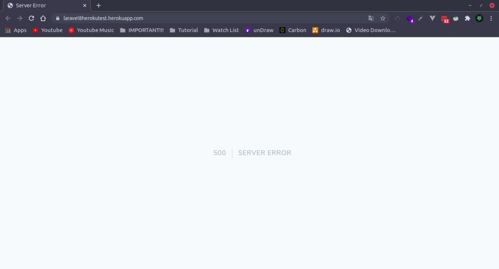
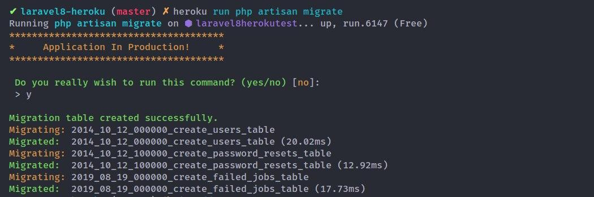

Source: [codepolitan](https://www.codepolitan.com/membuat-proyek-pertama-heroku-58b872c6217eb) [medium](https://medium.com/@amrilsyaifa_21001/tutorial-deploy-laravel-ke-hosting-heroku-5be2539365e0)

## Apa itu Heroku?

Heroku adalah sebuah cloud platform yang menjalankan bahasa pemrograman tertentu, Heroku mendukung bahasa pemrograman seperti Ruby, Node.js, Python, Java, PHP, dan lain-lain.

Heroku termasuk ke dalam kriteria Platform As A Service (PaaS), sehingga bagi anda yang ingin melakukan deploy aplikasi ke heroku cukup hanya dengan melakukan konfigurasi aplikasi yang ingin di deploy dan menyediakan platform yang memungkinkan pelanggan untuk mengembangkan, menjalankan, dan mengelola aplikasi tanpa kompleksitas membangun dan memelihara infrastruktur yang biasanya terkait dengan pengembangan dan peluncuran aplikasi.

## Registrasi Heroku


Daftar gratis platform heroku [disini](https://signup.heroku.com/).

## Instal Heroku-cli

[Download Heroku-cli](https://devcenter.heroku.com/articles/heroku-cli)

Silahkan download dan instal heroku-cli pada device masing-masing disini saya
menggunakan linux **ubuntu 18.04**.

langkah pertama untuk menginstal heroku-cli adalah menginstal snap, apa itu *snap*?
silahkan temen-temen kepoin sendiri ya :smile:.
```bash
sudo apt install snap
```

langkah selanjutnya, adalah menginstal heroku-cli
dengan perintah:
```bash
sudo snap install heroku --classic
```

cek versi heroku
```bash
heroku --version
  heroku/7.45.0 linux-x64 node-v12.16.2
```

## Persiapan Project Laravel

```bash
composer create-project --prefer-dist laravel/laravel laravel8-heroku
```
Tunggu proses instalasi Laravel hingga selesai.

Jika instalasi laravel sudah selesai, langkah selanjutnya menginstal dependency ui laravel
dengan perintah:
```bash
cd laravel-heroku
composer require laravel/ui
```

Tunggu proses instalasi laravel ui hingga selesai.

Jika proses instalasi sudah selesai, silahkan buka di text editor kesayangan masing-masing :smile:.


Pindahkan composer dependency (didalam file **composer.json**) require-dev ke require, menjadi seperti ini
```json
"require": {
  "php": "^7.3",
  "facade/ignition": "^2.3.6",
  "fideloper/proxy": "^4.2",
  "fruitcake/laravel-cors": "^2.0",
  "fzaninotto/faker": "^1.9.1",
  "guzzlehttp/guzzle": "^7.0.1",
  "laravel/framework": "^8.0",
  "laravel/tinker": "^2.0",
  "laravel/ui": "^3.0",
  "mockery/mockery": "^1.3.1",
  "nunomaduro/collision": "^5.0",
  "phpunit/phpunit": "^9.3"
},
```

## Konfigurasi dan Proses Hosting

Login heroku-cli
```bash
heroku login
```

Tekan enter atau apapun (selain ‘q’) untuk membuka browser yang akan menanyakan akun heroku
```bash
heroku: Press any key to open up the browser to login or q to exit:
```
setelah berhasil login heroku-cli, selanjutnya kita inisialisasi project kita menggunakan git. apa itu [**git?**](https://www.petanikode.com/git-untuk-pemula/)

```bash
git init
```

Langkah selanjutnya, membuat project di platform heroku
dengan perintah:
```bash
heroku create laravel8herokutest
```


Tambahkan file **Procfile** kedalam project laravel
```bash
touch Procfile
```

Tambahkan line berikut kedalam file **Procfile**
```
web: vendor/bin/heroku-php-apache2 public/
```

push project ke heroku
```bash
git add .
git commit -m "initial release"
git push heroku master
```

Tunggu proses build dan deploy sampai selesai...
Silahkan buka project dengan perintah:
```bash
heroku open
```


Apabila mengalami error seperti diatas, kita perlu melakukan konfigurasi terlebih dahulu, dengan menambahkan
```bash
heroku config:add APP_DEBUG=true
```
dan menambahkan key yang ada didalam file **.env**
```bash
heroku config:add APP_KEY=base64:e/qyhJhR8FeHQdWyIEGmeiqG7jH3nB92dQ4LvlT12L0=
```

untuk tambahan konfigurasi...(optional, recommended)
```bash
heroku config:add APP_NAME=Laravel
heroku config:add APP_ENV=production
heroku config:add APP_URL=http://laravel8herokutest.herokuapp.com/
```

Silahkan refresh kembali...

Nah kita sudah berhasil melakukan hosting / deploy project laravel menggunakan platform heroku.

## Menggunakan Database PGSQL Heroku

Instalasi addons pgsql heroku
```bash
heroku addons:create heroku-postgresql:hobby-dev
```


konfigurasi database
```bash
heroku pg:credentials:url
```


Lakukan perintah berikut untuk melakukan konfigurasi

```bash
heroku config:add DB_CONNECTION=pgsql
heroku config:add DB_HOST=ec2-3-218-112-22.compute-1.amazonaws.com
heroku config:add DB_PORT=5432
heroku config:add DB_DATABASE=d6q4cb3ts5h8hh
heroku config:add DB_USERNAME=uqmtrelwszitpc
heroku config:add DB_PASSWORD=3953287238eb8da3fd76479d42707394c1b97456d7a2e89e4d5802c8984bdd55
```

Setelah selesai melakukan konfigurasi, langkah selanjutnya adalah mengenerate auth scaffold laravel.
```bash
php artisan ui vue --auth
npm install & npm run dev
```

Migrasi database dengan perintah:
```bash
heroku run php artisan migrate
```


Push project ke heroku kembali...
```bash
git add .
git commit -m "add auth"
git push heroku master
```

Silahkan refresh kembali...


Nah kita sudah bisa menghubungkan database pgsql heroku kedalam project laravel.

> Kita sudah belajar melakukan hosting / deploy project laravel menggunakan heroku, untuk penjelasan
>lebih lanjut silahkan temen temen kepoin sendiri ya :smile:

> Tetep semangat belajar di masa pandemi ini ya temen temen.
