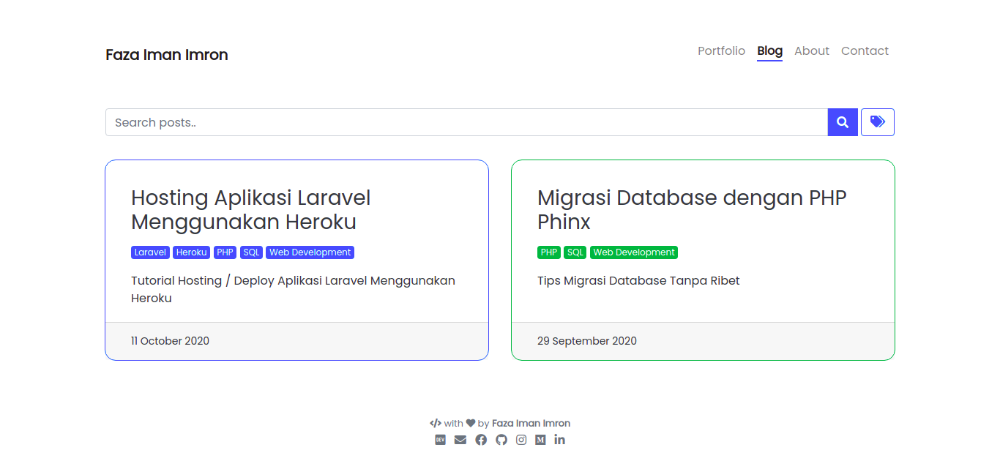

<!-- Source: [medium](https://medium.com/skyshidigital/membuat-web-scraper-di-node-js-497c59628042) -->

## Apa itu web scraping?

**Menurut wikipedia**, Web scraping merupakan kegiatan yang dilakukan untuk mengambil data tertentu secara semi-terstruktur dari sebuah halaman website. Halaman tersebut umumnya dibangun menggunakan bahasa markup seperti HTML atau XHTML, proses akan menganalisis dokumen sebelum memulai mengambil data.

Biasanya teknik scraping diimplementasikan pada sebuah bot agar bisa membuat proses yang harusnya dilakukan secara manual menjadi otomatis. Ketika kita menjumpai sebuah situs yang membatasi kuota API (Application Programming Interface) atau bahkan tidak menyediakan sama sekali, maka perayapan web akan sangat dibutuhkan sebagai langkah pengambilan data.

**Simplenya**, Web scraping merupakan proses mengambil informasi atau data dari suatu website melalui halaman antarmuka website. Jadi web scraping tidak mengambil informasi atau data melalui database.

**Kenapa menggunakan web scraping?**\\
web scraping dilakukan karena informasi atau data yang dibutuhkan tidak tersedia di API, atau bahkan tidak menyediakan API sama sekali.

## Prerequisites

Download [nodejs](https://nodejs.org/en/download/)

Silahkan download dan instal nodejs pada device masing-masing disini saya
menggunakan linux **ubuntu 18.04**.

```bash
sudo apt install nodejs
```

cek versi nodejs dan npm
dengan perintah:

```bash
node -v
npm -v
```

apabila muncul versinya dan maka sudah node dan npm siap digunakan.

## Persiapan Project

Silahkan buat folder dengan nama bebas dan buka di text editor kesayangan masing-masing, disini saya menggunakan visual studio code.


Setelah dibuka, kita akan mendownload library atau tools yang akan kita gunakan untuk scraping, yaitu: [scrape-it](https://github.com/IonicaBizau/scrape-it)

Install library scrape-it dengan perintah:

```bash
npm install --save scrape-it
```

Tunggu proses instalasi hingga selesai.

Jika instalasi telah berhasil maka akan ada struktur folder yang terdiri dari:

```bash
*node_modules
*package-lock.json
```

## Proses Scraping

Buat file javascript baru dengan nama bebas, misalkan **scrape.js**.\\
tambahkan kode berikut kedalam file tersebut,

```javascript
// inisialisasi library
const scrapeIt = require("scrape-it");

// fungsi scraping
const scrape = (url, option, _callback) => {
  scrapeIt(url, option).then(({ data }) => {
    _callback(data);
  });
};

// let's scrape here
```

Untuk memahami konsep scraping menggunakan javascript dan nodejs ini teman-teman harus paham basic dari javascript dom dan juga css selector, karena biasanya library scraping lain menggunakan _regex_ (**regular expression**) mengekstrak data, akan tetapi pada kebanyakan library node menggunakan dom langsung.

Nah, kali ini kita akan melakukan scraping pada halaman [**fazaimron27.tech/blog**](https://fazaimron27.tech/blog)



Mari langsung kita eksekusi :hammer:\\
klik kanan pada browser dan pilih inspect atau (ctrl + shift+ i).

Kita perlu membagi menjadi 2 bagian seperti berikut:


Dan jika diimplementasikan ke kode adalah

```javascript
// let's scrape here
const url = "https://fazaimron27.tech/";
const option = {
  blogs: {
    // listItem mengambil data yang berulang seperti col-lg-6
    // ditulis ".card-group .col-lg-6" karena col-lg-6 berada didalam .card-group
    listItem: ".card-group .col-lg-6",
    data: {
      title: ".card-body h3",
      link: {
        selector: "a",
        attr: "href",
      },
    },
  },
};

scrape(`${url}/blog/`, option, (data) => {
  for (product of data.blogs) {
    console.log({
      title: product.title,
      link: url + product.link,
    });
  }
});
```

Untuk bagian **data**, diambil dari bagian per itemnya (col-lg-6)


Langkah selanjutnya jalankan file javascript dengan mengetikkan:

```bash
node scrape.js
```


Nah data dari website sudah berhasil diambil.

## Simpan menjadi file **.json**

Edit file scrape.js\\
Tambahkan library filestream (fs) kedalam file tersebut,

```javascript
// inisialisasi library
const fs = require("fs");
const scrapeIt = require("scrape-it");
```

Tambahkan juga line berikut ketika fungsi scrape() dipanggil,

```javascript
scrape(`${url}/blog/`, option, (data) => {
  for (product of data.blogs) {
    console.log({
      title: product.title,
      link: url + product.link,
    });
    // simpan menjadi file blogs.json
    fs.writeFileSync("blogs.json", JSON.stringify(data));
  }
});
```

Jalankan kembali file tersebut dan lihat apa yang terjadi,

File blogs.json berhasil dibuat.

> Metode scraping ini memang sangat memudahkan, tetapi perlu diperhatikan untuk tidak melalukan scraping pada website yang datanya sangat penting atau tidak boleh diperjual belikan.

> Untuk referensi temen temen juga bisa melihat aturan-aturan web scraping [https://foundersguide.com/web-scraping-dos-donts/](https://foundersguide.com/web-scraping-dos-donts/)
