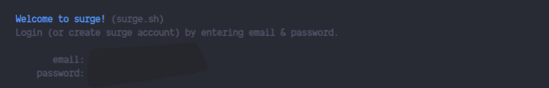
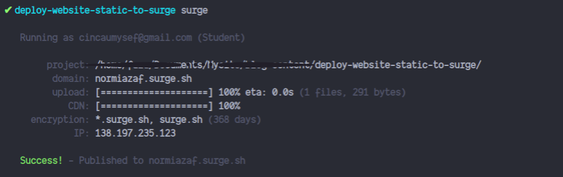
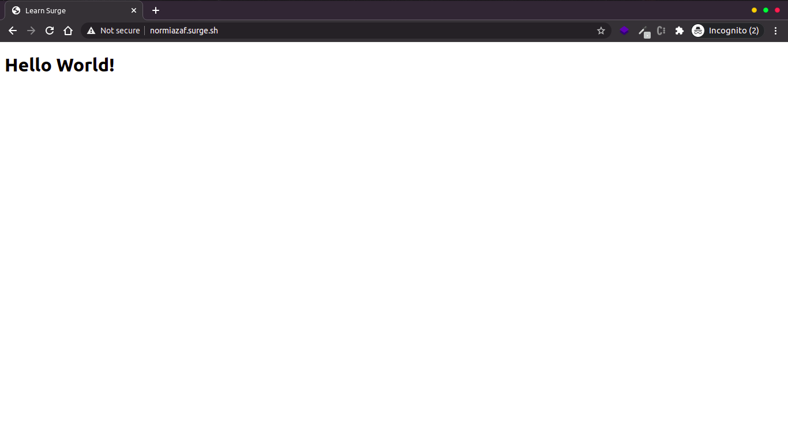

Source: [medium](https://medium.com/weekly-webtips/how-to-publish-a-static-web-using-surge-db1258527f0f)

## Apa itu Surge?

Surge adalah platform deploy/hosting website statis. Berbeda dengan Netlify dan Vercel, Surge Tidak memerlukan dashboard admin untuk mengelola projek. Surge menggunakan CLI (Command-line interface) yang tentunya sangat simple penggunaanya.

## Fitur-fitur Surge

- Free Custom Domain
- Free SSL untuk subdomain surge.sh
- Custom Halaman **404.html**

## Get Started

- Download dan install [nodejs](https://nodejs.org/en/download/)
- Install surge

```bash
npm install --global surge
```

- Untuk melalukan deploy jalankan perintah **surge** pada folder aplikasi.\\
  contoh, saya akan membuat file _index.html_ sederhana,

  ```html
  <!DOCTYPE html>
    <html lang="en"></html>
    <head>
        <meta charset="UTF-8">
        <meta http-equiv="X-UA-Compatible" content="IE=edge">
        <meta name="viewport" content="width=device-width, initial-scale=1.0">
        <title>Learn Surge</title>
    </head>

    <body>
        <h1>Hello World!</h1>
    </body>

    </html>
  ```

  di dalam folder projek tersebut coba jalankan perintah **surge**
  
  Pembuatan akun akan dilakukan saat pertama kali dijalankan.
  
  Kemudian cek domain tersebut sudah aktif atau belum.
  

  > Nah cukup mudah bukan ?, cukup 1 menit untuk melakukan proses deploy :smile:,
  > untuk dokumentasi resminya temen-temen bisa mengunjungi [surge](https://surge.sh/).
