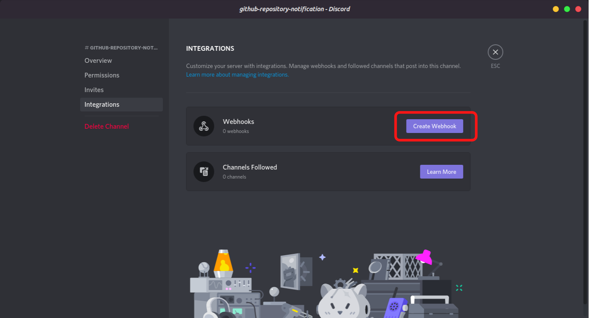
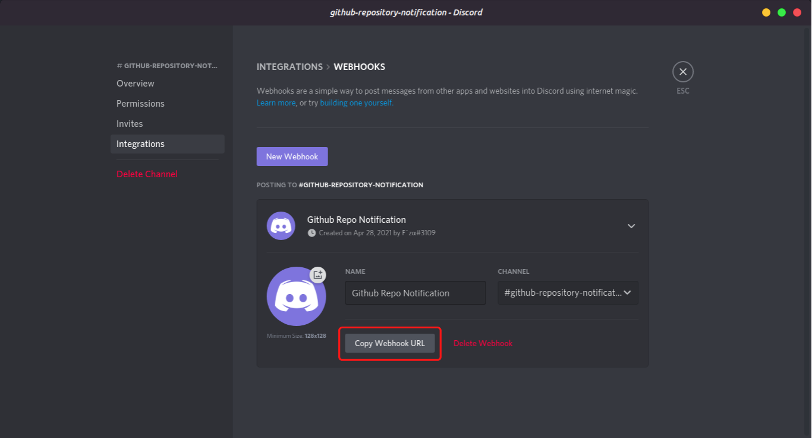
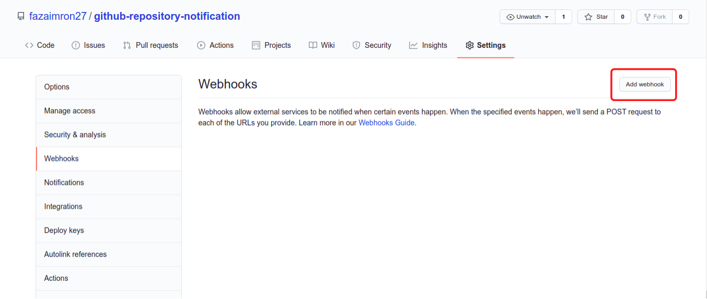
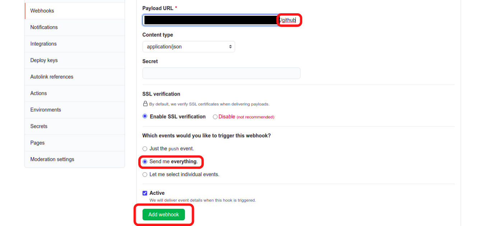
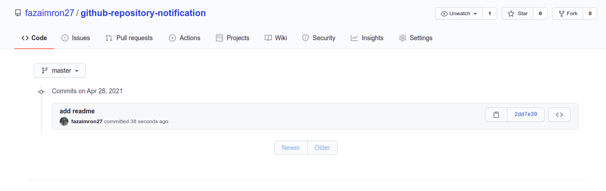
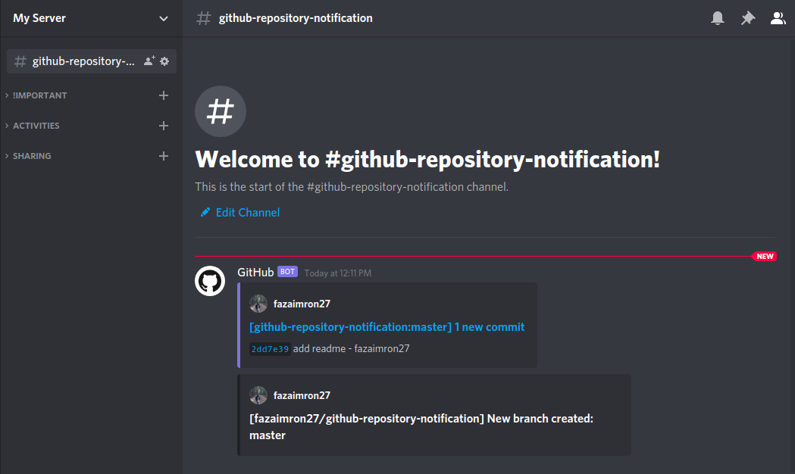

Source: [github](https://gist.github.com/jagrosh/5b1761213e33fc5b54ec7f6379034a22)

## Apa itu Discord?

**Discord** adalah aplikasi gratis untuk mengakses obrolan yang mirip dengan Slack atau Skype yang memungkinkan pengguna untuk mengobrol secara real time menggunakan teks, suara atau video. Awalnya dibuat untuk video gamer untuk berinteraksi satu sama lain saat bermain game. Discord saat ini semakin populer dengan lebih dari 100 juta pengguna saat ini. Aplikasi ini menampung server atau ruang obrolan tentang berbagai topik, mulai dari game, musik, anime, dan meme cenderung menjadi yang paling populer.

Selain dari kelebihan fitur-fitur diatas discord dapat juga kita manfaatkan sebagai jembatan atau sarana informasi dari repository github, yang sangat berguna jika kita bekerja sebagai tim, maka commit atau pesan apapun dapat kita terima melalui discord.

## Buat Discord Webhooks

Sebelum membuat webhook silahkan buat channel terlebih dahulu, dan dibagian edit channel :arrow_right: integrations, disanalah kita akan membuat webhooks.

## Setup

Silahkan buat repository baru dan dibagian settings :arrow_right: webhooks, disanalah kita akan setting weebhooks discord yang sudah kita copy.

Pastekan url discord webhooks pada Payload URL dan tambahkan **/github** diakhir.

## Testing

Coba kita buat perubahan sederhana pada repository github yang telah terintegrasi dengan discord webhooks.

Setelah melakukan perubahan coba kita cek channel discord apa yang terjadi,

Nah semua commit atau perubahan yang terjadi pada repository tersebut akan otomatis terkirim ke channel discord.

> Mudah bukan? terus apa gunanya webhooks ini jika di github sendiri sudah bisa melihat commit atau perubahan, nah jika anda seorang pemimpin tim maka anda tidam perlu susah-susah mengecek anggota mana yang sudah mengerjakan dan yang belum mengerjakan.

> Tetap semangat ya temen teman :smile:
